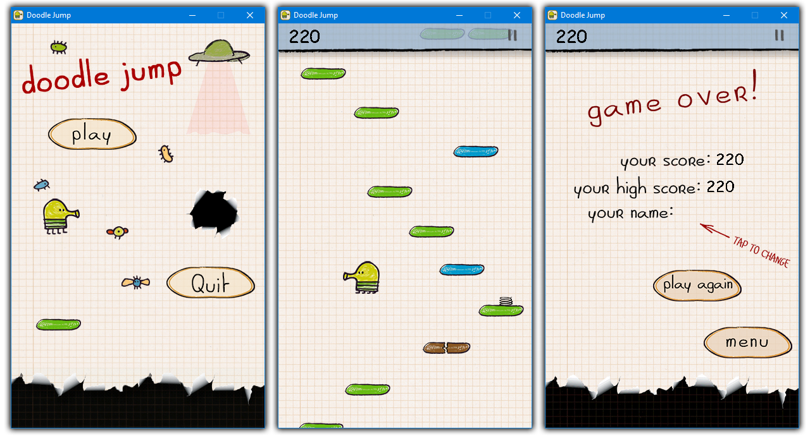

# Doodle Jump

- [Doodle Jump](#doodle-jump)
  - [About](#about)
  - [Keys](#keys)
  - [Installation](#installation)
  - [Building](#building)

## About

A simple Doodle Jump clone written in C++ using **[RSDL](https://github.com/UTAP/RSDL)**, a **[SDL2](https://www.libsdl.org)** wrapper.

## Keys

Move left and right with **A** and **D**.  
Pause the game with **P**.  
You can change these in the `consts.hpp` file.

## Installation

You can find the builds in the **[releases](https://github.com/MisaghM/Doodle-Jump/releases)** section.  
It is currently built with [MinGW32](https://sourceforge.net/projects/mingw-w64/files/mingw-w64)  
*(MinGW-W64 GCC-8.1.0 i686-posix-dwarf)*  
  
The required **SDL2** and **MinGW** DLLs are included in the release package.  
  
Check the **[wiki](https://github.com/MisaghM/Doodle-Jump/wiki/The-Sequence-File)** to see how the game's map is made and how you can make your own.

## Building

The following SDL2 libraries are used:

> - **[SDL2](https://www.libsdl.org/download-2.0.php)**
> - **[SDL2_image](https://www.libsdl.org/projects/SDL_image)**
> - **[SDL2_mixer](https://www.libsdl.org/projects/SDL_mixer)**
> - **[SDL2_ttf](https://www.libsdl.org/projects/SDL_ttf)**
  
First, download the required libraries and place them in the `lib/libSDL` folder.  
Then run the `Makefile`.  
  
*Note*: Installing SDL2 on some linux distros will automatically put the lib and include files in the environment PATH. So there's no need to put anything in the lib folder.  
  
You can use other compilers as long as they support the C++ 11 standard.  
  
The output executable (`doodle_jump.exe`) will be placed in the `output` folder. You can also run it using `make run`.  
  
(More info on the makefile [here](https://github.com/MisaghM/Makefile-Project-Template).)  
   

---

*All assets credit goes to **Lima Sky**, the creators of the original Doodle Jump game.*
